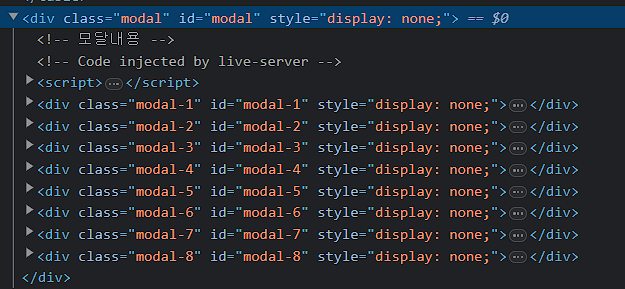
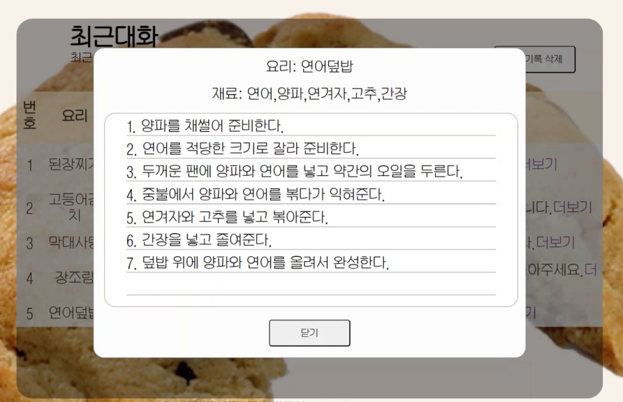

# 한정된 재료를 사용하여 요리하는 ChatBot

<image src=image/play.gif>
<br><br>

첫 개인 프로젝트입니다. GPT 모델 API를 활용하여 요리사 챗봇을 구현해보는 프로젝트 입니다.
해당 ChatGPT API는 부트캠프 기간 동안에만 작동됩니다. (~23/12/31)
## 1. 목표
<!-- ### 1-1. 목표 -->
- 먹고 싶은 음식과 가지고 있는 재료를 선택하면, 그에 맞는 레시피를 제시합니다.
- 짧고 간결한 요구사항으로 빠르게 API 응답을 얻을 수 있습니다.
- 원하는대로 요리재료를 사용하여 사용자의 요구사항 충족합니다.
- 가지고 있는 재료가 부족한 경우, 대체 재료를 알려줘 요리에 활용됩니다.

## 2. 개발환경 및 배포 URL
### 2-1. 개발 환경
<div> 
   
   </div>

### 2-2. 배포 URL
- https://blood-donation-day.github.io/ChatBot/
## 3. 프로젝트 구조와 개발 일정
### 3-1. 프로젝트 구조

#### 전체구조
```
ChatBot
│  bookmark.html
│  chat.html
│  index.html
│  README.md
│  recent.html
│
├─css
│      bookmark.css
│      chat.css
│      common.css
│      index.css
│      recent.css
│      result.css
│
├─image
│      background-1.png
│      bookmark.png
│      GPT-result.png
│      history.png
│      input.png
│      mainpage.png
│      play.gif
│      result.png
│      schedule.png
│
└─js
        bookmark.js  
        chat.js      ----   GPT API통신
        movepage.js  ---- 페이지 이동
        recent.js    ---- 최근기록 확인
```
<br>


<br><br>

#### 작동순서
```javascript
$button.addEventListener("click", e => {
    e.preventDefault() 
    const contents = `요리:${$menu.value} 재료${$Ingredients.value}`
    data.push({                        
        "role" : "user",
        "content" : contents
    })
    result(); //결과페이지
})
```
<br>

```javascript
async function GETGPT() {
    const res = await fetch(url, {   //데이터 전송 및 res에 답변내용 저장  
        method : "POST",
        headers: {
            'Content-Type': 'application/json'
        },
        body: JSON.stringify(data),
        redirect: `follow`
    })
    const answer = await res.json();   
    const answerText = answer.choices[0].message.content; //받은 데이터중 출력할 내용 저장
}    
```

1. 원하는 요리, 재료를 입력 후
요리하기! 버튼을 누르면 <code> 요리: [메뉴] 재료: [재료들] </code>로저장하고 데이터를 전송합니다.
<br>

```javascript

const data = []
data.push (
    {"role" : "system", "content" : "여러 재료를 사용하여 사용자의 요구에 맞춰주는 만능 요리사야"},
    
    //질문, 답변  > 여러개 가능
    {"role": "user", "content": "내가 만들고 싶은 메뉴와 가지고 있는 재료를 알려줄테니 방법을 알려줘. 반드시 내가 말한 재료만을 사용해야해. 만약 해당 재료들 만으로 만들기 어렵다면 만들지 못한다고 말해줘."},
    {"role": "assistant", "content": " 네 알겠습니다. 조리하고 싶으신 메뉴와 가지고 있는 재료를 알려주시면 방법을 알려드리겠습니다."},
    {"role": "user", "content": "원하는 메뉴와 재료를 알려주면 반드시 해당 재료만을 사용하여 요리법을 알려줘. 다른 재료는 사용하지말고. 요리법에 반드시 정확한 계량, 명확한 시간, 구체적인 방법을 표시해줬으면 좋겠어. 만약 요리가 불가능하다면 반드시 말해줘. 답변형식은 반드시 요리: [요리], 재료: [재료1, 재료2], 레시피: [1.순서1~, 2.순서2~], 사용하지않는 재료: [사용하지않는재료] 형식으로 보내줘. "},
    {"role": "assistant", "content": " 네 알겠습니다. 정해진 형태를 지켜 답변형식을 설정하겠습니다. 반드시 정확한 수치, 시간, 구체적인 방법을 포함하여 답변하겠습니다. 말씀하신 재료만 사용하여 조리하고 싶으신 메뉴와 가지고 있는 재료를 알려주시면 방법을 알려드리겠습니다. 만약 해당 재료만으로 요리가 불가능하다면 알려드리겠습니다."},
    {"role": "user", "content": " 예를들어 밀가루로 면을 만들라는 너무 억지스러운 조리법은 삼가해줘. 반드시 그 답변을 JSON 형식으로 담아서 보내줘 반드시 그 외 다른 불필요한 말은 생략해줘. 반드시 파싱과정에서 문제가 없는지 확인하고 보내줘"},
    {"role": "assistant", "content": "실제로 원할한 수행이 가능한 조리법을 제공하겠습니다. 네 답변을 JSON형식으로 보내고 그 외 불필요한 정보는 제공하지 않겠습니다. "},
    )
```

2. 프롬프트 엔지니어링로 답변을 <code>{요리: 요리, 재료: 재료1,재료2... 레시피: 레시피...}</code> 형식으로 받아옵니다.

<br>

```javascript

async function local(text) {
    const json = JSON.parse(text);   
    // 로컬스토리지에서 받아오고 답변내용 추가 후 로컬스토리지에 넣기
    let GPT_result = localStorage.getItem(`log1`);
    if (!GPT_result) {
        GPT_result = [];
    } else {
        GPT_result = JSON.parse(GPT_result);
    }
    GPT_result.push(json);
    localStorage.setItem(`log1`, JSON.stringify(GPT_result))
}
```

3. 기존 로컬스토리지 안의 내용을 가져와서 (없다면 새로 생성)

변수로 저장하고 API가 보내준 내용을 추가한 후 다시 로컬스토리지로 저장합니다.


<br>
    <p align="center"></p>
    
    로컬스토리지에 저장된 모습
<br>


```javascript
function loadData () {
    const localdata = localStorage.getItem(`log1`)
    const jsonData = JSON.parse(localdata) 
    if (jsonData) {
    for (let i=0; i < jsonData.length; i++) {
        
        const tr = document.createElement('tr');  //테이블 행
        tr.classList.add('localdata');
        const tdnum = document.createElement(`td`); // 번호 (요리, 재료 생략)
        tdnum.classList.add(`localdata-column`);
        const tdRecipe = document.createElement('td'); //레시피
        tdRecipe.classList.add('localdata-column');
        const $recipepreview =  jsonData[i].레시피; 
        const $receipePrev = $recipepreview.slice(0, 1);
        //tr안에 td요소들 넣기
        tr.appendChild(tdnum);
        tr.appendChild(tdCook);
        tr.appendChild(tdIngredients);
        tr.appendChild(tdRecipe);
    }}}
```

4. 최근 기록탭에서 로컬스토리지에 저장된 데이터를꺼내 테이블로 만듭니다.
    for 문으로 로컬스토리지의 인덱스 길이만큼 작업을 반복합니다.
<br>
<p align="center"></p>

    로컬스토리지에서 받아와 테이블로 만든 모습.
<br>

```javascript
function loadData () {
    const localdata = localStorage.getItem(`log1`)
    const jsonData = JSON.parse(localdata) 
    if (jsonData) {
    for (let i=0; i < jsonData.length; i++) { 
        //모달창 안의 내용
            const $createmodal = document.createElement(`div`);
            $createmodal.classList.add(`modal-${i+1}`);
            $createmodal.id = `modal-${i+1}`;
            $createmodal.style = `display:none;`
            //모달 요소 넣기
            $createmodalcontent.appendChild($createmodalcook);
            $createmodalcontent.appendChild($createmodalIngredients);
            $createmodalcontent.appendChild($createmodalclose);
            $createmodal.appendChild($createmodalcontent);
            const $modal = document.getElementById(`modal`);
            $modal.appendChild($createmodal);
            //모달열기
            aRecipe.addEventListener(`click`, (e) => {
                e.preventDefault();
                const $modalstyle = document.getElementById(`modal-${i+1}`)
                const $allmodalcontent = document.getElementsByClassName(`modalcontent`)
                //만들어진 클래스 modal-1 modal-2... 갯수만큼 반복
                for (let i=0; i < $allmodalcontent.length; i++) {   
                    $modalcontent = $allmodalcontent[i];
                    $modalcontent.style.display = "block";
                }
                $modal.style.display = "block";
                $modalstyle.style.display = "block";
            })}} 
} else {     
    }
```
5. 테이블을 만들 때 모달에 관한 내용도 같이 만들고 숨김처리를 한 후
    더보기 버튼을 누르면 모달창을 띄웁니다. ( loadData 함수안에 같이 있습니다.)



    테이블과 함께 생성된 모달 부분 문서
    
    평소에는 display="none" 으로 숨김처리하고 버튼을 클릭할 때 display="block"으로 변경하여 모달창을 띄웁니다.
<br>

    
    더보기를 클릭하여 모달창을 띄웠을 때 모습.


<br><br><br>

### 3-2. 개발 일정


## 4. UI/BM
### 4-1. 목업 페이지
https://ovenapp.io/view/1owd3hXXnyJLpCNEW32jEA8qkdlTz55Y/eYKFa
- 메인페이지

- 재료 넣기

- 결과

- 대화기록

- 즐겨찾기


## 5. 개발하며 느낀점

#### 5.1 소감
첫 개인 프로젝트를 완료하면서 정말 의미 있는 경험을 했습니다.
이 프로젝트를 통해 개발의 다양한 측면에서 많은 것을 배우고 성장할 수 있었고, 처음으로 실제 동작하는 소프트웨어를 만들어 볼 수 있어 성취감을 느꼈습니다.
물론, 프로젝트 진행 중에는 여러 어려움과 문제에 부딪혔지만, 코드를 한줄한줄 분석하고
모르는건 물어보면서 개발경험을 쌓는 과정이였습니다.

#### 5.2 문제해결과정

1. 로컬스토리지에 저장 후 새로고침시 초기화되는 문제

```javascript
const GPT_result = []
async function local(text) {
    const json = JSON.parse(text);   
    let GPT_result = localStorage.getItem(`log1`);
    GPT_result.push(json);
    localStorage.setItem(`log1`, JSON.stringify(GPT_result))
```
받은 결과를 저장해줄 변수 GPT_result를 지정하고 로컬스토리지에 저장하려 했으나
GPT_result가 새로고침시 초기화가 되므로 변수를 덮어씌우는 로컬스토리지까지 같이 초기화되는 문제발생.

```javascript
async function local(text) {
 const json = JSON.parse(text);   
    let GPT_result = localStorage.getItem(`log1`);
    if (!GPT_result) {
        GPT_result = [];
    } else {
        GPT_result = JSON.parse(GPT_result);
    }
    GPT_result.push(json);
    localStorage.setItem(`log1`, JSON.stringify(GPT_result))
```
로컬스토리지에 있는 값을 가져온 후 만약 데이터가 없다면 변수를 새로 지정하고
있으면 기존 데이터에 값을 추가하는 방법으로 변경하였습니다.

2. 데이터를 받아 테이블을 만드는 과정에서 로컬스토리지가 비어있을 때 오류발생

```javascript
if (jsonData.length !== null) {
    for (i=0; i < jsonData.length; i++) {
    
        const tr = document.createElement('tr');  //테이블 행, (번호, 요리, 재료, 생략)
        tr.classList.add('localdata');
        //tr안에 td요소들 넣기
        tr.appendChild(tdnum);
        tr.appendChild(tdCook);
        tr.appendChild(tdIngredients);
        tr.appendChild(tdRecipe);
        //body안에 만들어진 tr넣기
        $body.appendChild(tr);
    }
    } else {
        
    }
```
값이 null이 아니면 jsonData.length만큼 반복하여 테이블요소들을 만든다. 라고 하려했습니다.
그러나 로컬스토리지가 비어있을 때 오류가 발생해 막혔습니다.
null에는 length라는 속성이 없기 때문에 발생하는 오류였고 
```javascript
    if (jsonData.length !== null)   >>>>    if (jsonData)
```
로 변경하였습니다.

3. 변수 선언을 하지 않음으로서 생기는 문제.

모달을 만드는 과정에서 계속 에러가 나서 발견한 오류입니다.
```javascript
// 로컬스토리지 인덱스 수 만큼 모달에 eventListener를 설정
for (i=0; i < jsonData.length; i++) {
    aRecipe.addEventListener(`click`, e => {
        e.preventDefault();
        const $modalstyle = document.querySelector(`.modal-${i+1}`)
            $modalstyle.style.display = "block";
})
}
```
2번문제에서 변수선언 없이 for문에서 i 라는 변수를 사용하였고 전역변수로 들어가 
다음과 같은 문제가 발생습니다.

```javascript
for (let i=0; i < jsonData.length; i++)
```
let으로 선언하여 변수선언이 곂치는 문제를 해결했습니다.
해결하는데 가장 시간이 오래걸린 문제였고, 변수선언의 중요성을 경험했습니다...


#### 5.3 아쉬운점
즐겨찾기기능 구현, 최근대화에서  갯수가 많아지면 페이지별로 나누는 기능을 구현하지 못했습니다.
최근기록에서 사용자가 즐겨찾기로 등록해 해당 내용들을 볼 수 있는페이지와
페이지별로 나누는 기능인 페이지네이션을 추가하면 대화 기록을 더 효율적으로 관리할 수 있을 것입니다.

이러한 아쉬움을 다음 프로젝트나 개발 경험으로 활용하는 기회라고 생각합니다.
미구현된 기능들을 다음 프로젝트에서는 더 주의깊게 다루고 
완성도 높은 프로젝트를 완성하는데 노력해야할 것 같습니다.


<!-- 채팅보내고 받을 때 활용할 기초 내용 정리
주제 뭐로하지?? 
주제: 메뉴와 재료를 알려주면 요리방법을 알려주는 챗봇

한정된 재료와 원하는 메뉴를 알려주면 해당 재료로 원하는 메뉴를 만드는 방법을 알려주는 챗봇
재료는 검색하여 선택 // 메뉴는 직접 입력

요리: 국수 재료: 면, 간장
기본대화내용
질문 & 답변  대화창  

질문내역 / 질문내역 초기화.
            메뉴바  
            메인 컨텐츠 다른 페이지 article 태그 받아와서 집어넣기 


주제: 아 이걸 멀로해야되나....


예시?
피자주문 
    1. 주소를 입력
        근처 피자집 검색
        가장 가까운 피자집 지도 >> 확인 클릭
    2. 메뉴선택
    각종 메뉴 / 옵션 (사이즈, 사이드메뉴)
    
    3.결제창 >> 결제  -->